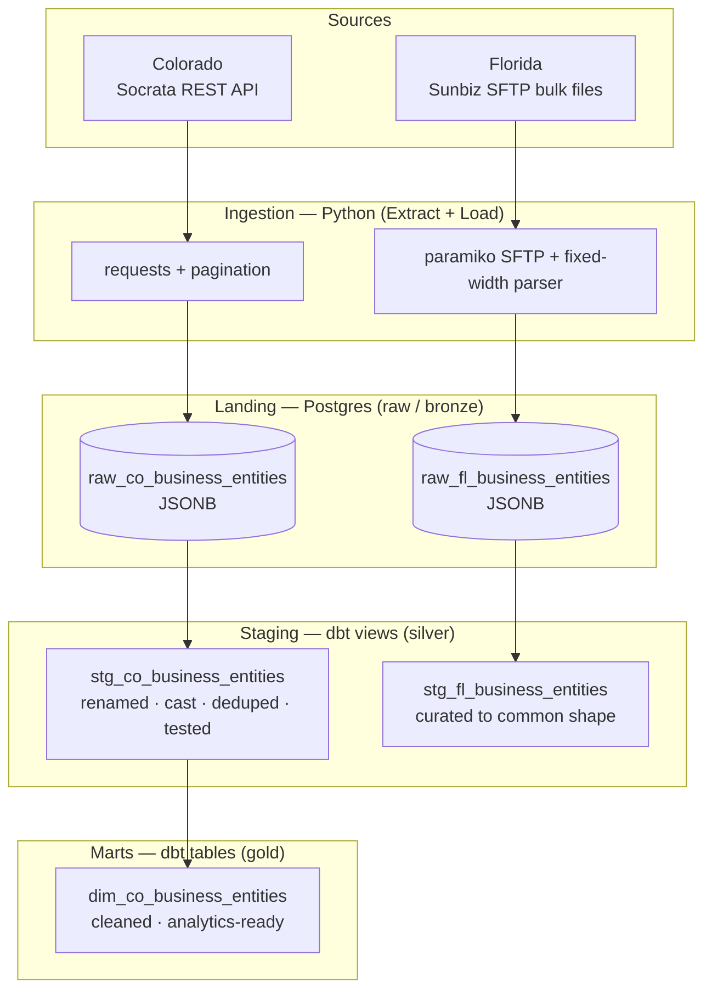

# tributary-pipeline

A multi-state business-registry data pipeline that ingests public corporate
records from state government sources, lands them as raw JSON, and transforms
them into clean, tested, analytics-ready tables using dbt.

The project demonstrates an end-to-end ELT workflow over messy, real-world
government data: multiple ingestion patterns (REST API and bulk SFTP files),
a raw → staging → marts modeling architecture, data quality testing, and
deduplication — all built to run reproducibly on a local Postgres instance.

---

## Why this project

Every U.S. state publishes business-entity registration data as public record,
but each does so in its own format, through its own access mechanism, with its
own quirks and inconsistencies. Unifying that data is a realistic data
engineering problem: heterogeneous sources, no clean schema, and data that
routinely violates reasonable assumptions.

`tributary-pipeline` takes several of these sources and normalizes them into a
single consistent model. The name reflects the shape of the problem — many
small, differently-shaped sources feeding into one river.

---

## Architecture

The pipeline follows a layered ELT design. Python handles **extract and load**
only — it moves raw records into Postgres with minimal interpretation. All
**transformation** happens in dbt, in SQL, in version-controlled models.



**Design principle:** land raw data faithfully, defer all interpretation to dbt.
Each source's full record is stored untouched as `JSONB` in a landing table.
The staging layer then cracks that JSON open into clean, typed, consistently
named columns — so however different two sources look on the way in, they share
a common shape by the time anything queries them.

| Layer | Tool | Materialization | Purpose |
|-------|------|-----------------|---------|
| Landing (bronze) | Python | Postgres table (`JSONB`) | Faithful raw capture, never fails on source quirks |
| Staging (silver) | dbt | View | Rename, cast, deduplicate, standardize structure |
| Marts (gold) | dbt | Table | Business logic, content cleaning, analytics-ready |

---

## Tech stack

- **Python** — ingestion (`requests`, `paramiko`, `psycopg2`, `python-dotenv`)
- **PostgreSQL** — landing and warehouse (local, `JSONB` landing tables)
- **dbt** (`dbt-core` + `dbt-postgres`) — all transformations, tests, and lineage
- **DBeaver** — database exploration and verification
- **Git / GitHub** — version control

Dependencies are pinned in `requirements.txt` for reproducibility.

---

## Data sources

| State | Source | Access method | Format |
|-------|--------|---------------|--------|
| Colorado | [Colorado Open Data Portal](https://data.colorado.gov) | Socrata REST API | JSON |
| Florida | [Sunbiz / FL Division of Corporations](https://dos.fl.gov/sunbiz/) | Public SFTP | Fixed-width bulk files |

All data used is **public record**, accessed through each state's officially
provided bulk-access or open-data channel — Colorado's sanctioned Socrata API
and Florida's published public SFTP endpoint. No scraping of access-restricted
pages, no circumvention of anti-bot measures. Credentials (even Florida's
publicly published SFTP login) are kept out of source control via a
`.env` file.

---

## What this project demonstrates

- **Multiple ingestion patterns** — a paginated REST API (Colorado) and
  authenticated SFTP bulk-file downloads with fixed-width parsing (Florida),
  unified into one landing pattern.
- **ELT with clean separation of concerns** — Python extracts and loads; dbt
  owns every transformation, in SQL, under version control.
- **Raw-first / medallion architecture** — `JSONB` landing tables preserve the
  source exactly, so ingestion never breaks on unexpected data and all cleaning
  is reproducible downstream.
- **Data quality testing** — dbt tests (`unique`, `not_null`, `accepted_values`)
  that caught real defects in the source data, including duplicate entity
  records and undocumented status values that a small sample never revealed.
- **Deduplication** — window-function (`row_number()`) dedup in staging to
  enforce one row per real-world entity.
- **Real-world data cleaning** — regex-based normalization of malformed entity
  names where status/date text had been appended into the name field.
- **Reproducibility** — pinned dependencies and a verified clean-room install;
  the repo builds the same environment from scratch on any machine.
- **Scale** — validated on Colorado's full registry of **3,000,000+** records,
  not just a sample.

---

## Project status

This is an actively developing project. Colorado is complete end-to-end;
Florida ingestion is in progress.

| State | Ingestion | Staging | Marts | Tests |
|-------|-----------|---------|-------|-------|
| **Colorado** | ✅ Full load (3M+ records) | ✅ | ✅ | ✅ |
| **Florida** | 🚧 In progress (SFTP + parser verified) | ⬜ | ⬜ | ⬜ |

**Colorado** is a complete vertical slice: paginated API ingestion into a
`JSONB` landing table, a tested and deduplicated staging view, and a cleaned
`dim_` marts table — validated at full scale.

**Florida** ingestion is underway: the SFTP connection and the fixed-width
record parser (79 fields, 1,440-character records) are built and verified
against live Sunbiz files. The download loop and load step are next.

---

## Repository structure

```
tributary-pipeline/
├── ingestion/
│   ├── colorado/
│   │   └── load.py          # Socrata API → paginated fetch → JSONB landing
│   └── florida/
│       └── load.py          # Sunbiz SFTP → fixed-width parse → JSONB landing
├── tributary/               # dbt project
│   └── models/
│       ├── staging/         # stg_* views + source/schema tests
│       └── marts/           # dim_* analytics tables
├── requirements.txt         # pinned dependencies
└── README.md
```

---

## Running it locally

> Requires PostgreSQL and Python 3.13. Colorado ingestion needs only internet
> access; Florida needs the public Sunbiz SFTP credentials (published openly by
> the state).

**1. Clone and set up the environment**

```bash
git clone <repo-url>
cd tributary-pipeline
python -m venv .venv
source .venv/bin/activate        # Windows: .venv\Scripts\Activate.ps1
pip install -r requirements.txt
```

**2. Create the database**

```bash
createdb tributary
```

**3. Configure environment variables**

Create a `.env` file in the project root:

```
TRIBUTARY_DB_HOST=localhost
TRIBUTARY_DB_PORT=5432
TRIBUTARY_DB_NAME=tributary
TRIBUTARY_DB_USER=postgres
TRIBUTARY_DB_PASSWORD=your_password
```

**4. Run ingestion**

```bash
python ingestion/colorado/load.py
```

**5. Build and test the dbt models**

```bash
cd tributary
dbt build          # runs and tests all models in dependency order
```

---

## Notes and lessons

A few things this project surfaced that are worth recording:

- **A small sample badly misrepresented the full dataset.** Colorado's first
  3,000 records suggested one status distribution; the full 3M told a
  completely different story and contained status values the sample never
  showed. Schemas and `accepted_values` lists were finalized against full-scale
  data, not samples.
- **Tests are for the assumptions you don't know you're making.** The `unique`
  test on entity ID failed because the source genuinely lists some entities
  twice — a fact discovered only because the test existed.
- **`dbt build` stops the chain on failure.** When a staging test fails, the
  downstream marts are skipped rather than built on unvalidated data — which is
  why it's preferred over `dbt run` for a trustworthy pipeline.
